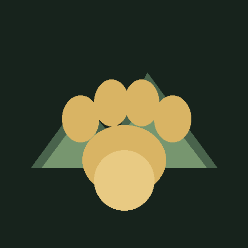

<div align="center">



# LUCA DOG WORLD 🐕🌲

**A strange open-world dog adventure built on deterministic systems, persistent consequences, and an unreasonable amount of verification.**

`small knife. sharp edge. big world.`

</div>

---

## 🌎 What this is

**Luca Dog World** is an experimental first-person open-world game built in **Godot 4.3**.

The goal is not to make another giant empty procedural map.

The goal is to build a world that can keep expanding while still remembering what happened inside it:

- terrain and locations generated deterministically from world state;
- authored places living beside procedural wilderness;
- weather, rivers, mountains, vehicles and streamed NPCs;
- persistent changes stored as deltas instead of rewriting the world;
- a dog companion who is part of the simulation rather than a decorative follower;
- tools and mods that can change the world without gaining unrestricted access to the machine.

And, most importantly:

> **If the game says something happened, the architecture should be able to prove why.**

---

## 🐕 Luca is not a waypoint

Luca has a six-state companion brain:

`IDLE → FOLLOW → INVESTIGATE → WAIT → RECOVER → REST`

He can follow the player across the world, recover when separated, react to nearby points of interest, and be interacted with through the same first-person interaction systems used by the rest of the game.

The long-term goal is for Luca to feel less like an NPC attached to the player and more like another creature actually inhabiting the world.

---

## 🗺️ The world machine

The current standalone world contract is intentionally explicit.

| System | Current contract |
|---|---|
| Engine | Godot 4.3 |
| World generator | `luca-world-v1` |
| Chunk size | 128 m |
| Subcell size | 32 m |
| Biomes | 10 |
| Minimum location types | 20 |
| Generation passes | seed → region → biome → terrain → hydrology → sites → ecology → objects |
| Preload ring | 7×7 chunks |
| Render ring | 5×5 chunks |
| Physics ring | 3×3 chunks |
| Streaming hysteresis | 2 cells |
| Persistence | immutable descriptors + delta-only mutations |

The generator is deterministic: the same world seed, chunk coordinates and generator version are intended to reproduce the same chunk description.

Persistent gameplay changes are recorded separately as:

`removed · moved · collected · spawned`

That separation is deliberate. The generated world remains reproducible while the player's history remains real.

---

## 🌲 Current terrain

The open-world layer currently carries ten biome families:

- Sunmeadow Fields
- Whisperpine Woods
- Creekglass Wetlands
- Redclay Badlands
- Mirror Lakes
- Cloudstep Highlands
- Starlight Range
- Old Orchard Country
- Firefly Marsh
- Riverstone Valley

The accepted open-world contract also includes streamed terrain, climbable mountain-scale elevation, animated rivers, dynamic weather, independent NPCs, driveable vehicles, and authored spaces connected into the larger world.

This is still an evolving game. The point of the contract is not to pretend the world is finished; it is to stop future work from quietly shrinking it back into a room demo.

---

## 🧰 World tools

The player-tool framework currently exposes:

- **Object Tether** — hold, carry, reposition and release physics props.
- **Builder** — framework hook for controlled construction.
- **Remover** — framework hook for removing supported world entities.
- **Inspector** — framework hook for examining world/entity state.

An earlier design used direct force/impulse manipulation. The rebuilt standalone runtime intentionally uses the safer object-tether implementation instead.

That difference is recorded rather than hidden.

---

## 📦 `.lucamod`

Luca Dog World includes an intentionally constrained mod surface.

Supported mod permissions:

`spawn · decorate · dialogue · recipes`

Explicitly denied capabilities:

`filesystem · shell · network · native_code · process`

The mod VM currently accepts a small deterministic operation set:

`emit_text · set_tag · spawn_request · objective`

Mods are loaded from `.lucamod` archives, validated before execution, checked for unsafe archive paths, and incorporated into a deterministic mod-set hash.

The objective is moddability without turning a game archive into arbitrary machine access.

---

## 🧠 Why this repository exists

Luca Dog World grew out of a much larger experimental codebase.

For a while, the Luca game existed as a lane inside **Hive-Lattice** while its open-world systems, first-person controls, terrain, weather, vehicles and companion behavior were being developed.

That became confusing.

This repository is now the **canonical home of Luca Dog World**.

The earlier history is intentionally preserved because those commits are part of how the game became what it is. From this point forward, Luca-specific development belongs here.

The verified standalone rebuild entered this repository from recovery commit:

`3a7df99987db5d820dab8d1ecdf4b162e8b18377`

---

## 🧪 Verification before vibes

This project follows the same rule as the rest of the workshop:

> **No receipt, no banana.**

The v0.11 standalone rebuild was accepted with:

| Gate | Result |
|---|---:|
| Python test suite | **481 passed / 1 skipped** |
| Native Godot acceptance | **395 / 395 passed** |
| LucaBench | **11 / 11 suites · 29 assertions** |
| Demolition scenarios | **4 / 4 passed** |
| Godot script parse | **72 scripts parsed** |
| Open-world PCO | **PASS · bullshit_score=0** |

The demolition pass includes:

- 500 chunk-boundary crossings;
- 128 corner teleports;
- 300 persistence mutations while preserving immutable baseline descriptors;
- a 5,000 m streaming/flight torture route.

Headless Godot can still emit known dummy-renderer cleanup noise during acceptance. The verification gate records that output instead of silently suppressing it.

---

## 🔬 Run the receipts

Tested development environment:

- Windows
- Python 3.11
- Godot 4.3

From the repository root:

```powershell
python tools\luca\run_lucabench.py
python tools\luca\demolition_agent.py
python tools\verify_native_contract.py
```

The smaller architecture suite can also be run directly:

```powershell
python -m unittest tests.test_luca_world_architecture -v
```

---

## 🏗️ Build it

The native build script produces the Windows build and, when the Android toolchain is available, the Android APK:

```powershell
powershell -ExecutionPolicy Bypass -File .\BUILD_NATIVE_PC.ps1
```

Current product identity:

```text
Name:       Luca Dog World
Version:    0.11.0
Android ID: com.onekawaii.lucadogworld
```

### 📱 Download Android

[**Download Luca Dog World v0.11.0 APK**](https://github.com/Onekawaii/Luca-Dog-Lane/releases/download/v0.11.0/Luca-Dog-World-v0.11.0-android.apk)

SHA-256: `bf8b6da0a81daa72fbd99bee13b5272cb74060c37dc52a3c4cd1767c650eb9e5`

[Release notes + checksum file](https://github.com/Onekawaii/Luca-Dog-Lane/releases/tag/v0.11.0)
The verified v0.11 rebuild produced Windows and Android artifacts with SHA-256 sidecars plus an exact-state release receipt.

---

## 🧬 Architecture trail

The standalone Luca layer lives primarily under:

```text
game_godot/scripts/luca/
├── LucaWorldConfig.gd
├── LucaWorldGenerator.gd
├── LucaChunkDatabase.gd
├── LucaWorldStreamer.gd
├── LucaChunkRenderer.gd
├── LucaWorldPersistence.gd
├── LucaCompanionBrain.gd
├── LucaWorldRoot.gd
├── LucaEntityRegistry.gd
├── LucaObjectTether.gd
├── LucaToolSystem.gd
├── LucaModManager.gd
├── LucaModVM.gd
└── LucaAddonImporter.gd
```

The verification machinery lives under:

```text
tools/luca/
├── architecture_manifest.json
├── luca_build_context.py
├── run_lucabench.py
└── demolition_agent.py
```

The architecture manifest is meant to be readable by both humans and automation. If the game's promises change, the contract should change with them.

---

## 🚧 What I am not pretending

This is not a finished commercial open-world game.

Some systems are mature enough to have hard contracts. Others are framework hooks waiting for deeper gameplay.

There is inherited machinery from the project's Hive-Lattice ancestry that still needs continued separation and cleanup.

The interesting part is that the project is now in a state where those changes can be made **without losing the evidence trail**.

---

## 🦍 Operating principle

> **Build the world. Break the world. Reproduce the failure. Fix the model. Keep the receipt. Pet the dog.**

**AWK AWK. 🐕🍌**
